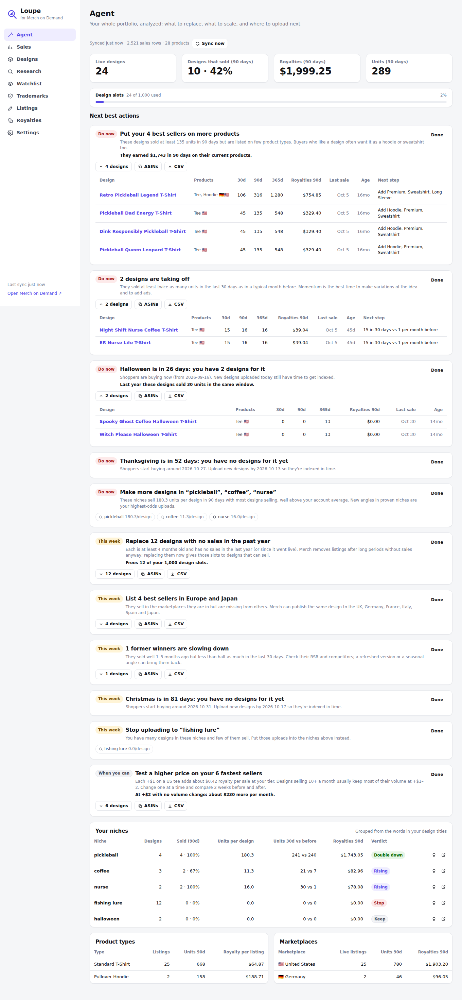
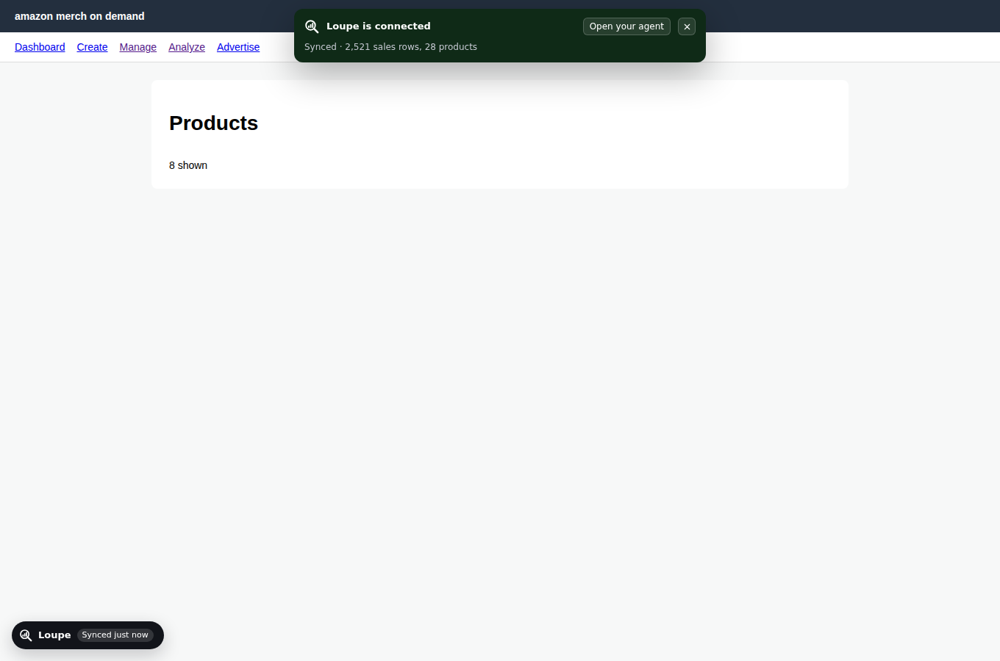
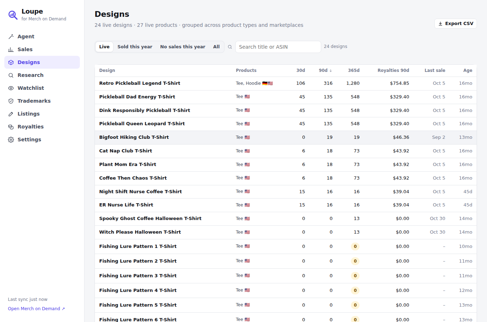

# Loupe for Merch on Demand

A Chrome extension (Manifest V3) for Amazon Merch on Demand sellers. It connects to your
Merch account with the session you're already signed in with, downloads your sales
history and full catalog, and runs a **portfolio agent** that tells you what to replace,
what to scale and which niches to upload more of. It also covers what **Snap** and
**Productor** do (BSR research on Amazon, listing tools, trademark checks). All your data
stays in your browser.



## What it does

| Area | Features |
| --- | --- |
| **Account sync** | One click on **Connect Merch account**: Loupe opens Merch in a tab, learns how your sales report and product list load, then downloads up to 400 days of daily sales across all marketplaces and every product in your catalog. After that it syncs on its own every 30 minutes, with new-sale notifications and today's units on the toolbar icon. |
| **Portfolio agent** | Groups your products into designs and niches and ranks actions: designs to **replace** (no sales in a year, with slot math against your tier), best sellers to **put on more product types** and **marketplaces**, designs **taking off** or **slowing down**, **niches to double down on or stop**, **upcoming seasons** with upload deadlines and last year's numbers, high **return rates**, and **price tests**. Every action lists its designs with ASINs and CSV export. |
| **Designs** | Your whole catalog grouped by design, including designs that never sold, with 30/90/365-day units, royalties, last sale and age. |
| **Amazon search** | Toolbar with a **niche score**, median BSR, number of results under 100k BSR, average estimated sales, median age, Merch share and result count. A badge on every result shows its BSR, estimated monthly sales, age, Merch detection, sub-category rank and review count. Sort by best BSR, newest or reviews; filter to Merch only, hide ads, cap the BSR; export CSV; copy ASINs; one-click **Merch filter** that limits the search to Merch shirts. |
| **Amazon product page** | Floating panel: BSR with category ranks, sales estimate, publish date and age, price and reviews, **royalty at this price for all three tiers**, extracted keywords (click to copy), trademark and policy scan with USPTO/TMview links, BSR history, **Track BSR**. |
| **Sales** | Today, yesterday, 7/30/90 days, month to date, last month, year to date and all time. Units, royalties, royalty per unit and designs sold, each compared with the previous period. Daily, weekly or monthly chart with a table view; breakdowns by marketplace and product type; top designs. Filter by marketplace and product type. Royalties are converted into one currency. |
| **Research** | Keyword ideas from Amazon's autocomplete ("seed + a…z", ranked by how often and how high Amazon suggests them), across all seven marketplaces. **Niche analysis**: reads the top Merch results for a keyword and scores demand, competition and freshness from 0 to 100. |
| **Watchlist** | Track any ASIN, yours or a competitor's. Its BSR is re-checked in the background, with a history chart and 7-day change. |
| **Trademarks** | Flags famous brands and franchises, legally protected terms (Olympic, NASA, Red Cross…) and phrases the Merch content policy rejects (shipping, price and review claims, "officially licensed", charity and health claims, URLs). Add your own always-flag and never-flag lists. Every phrase links to USPTO and TMview. |
| **Listings** | Listing studio with Merch's character limits, live trademark check and autosave. **Fill on Merch** puts a draft into the create page in one click. On Merch itself, a dock offers fill-from-draft, **bullets → description**, **find & replace across all fields** and a live trademark check as you type. |
| **Royalties** | Calculator for every product type, marketplace and tier (Creator, Plus, Premium), with price floor, a price ladder and "sales needed for your goal". **Calibrate** against the royalty Merch shows and every estimate for that product becomes exact. |
| **Data** | CSV import (columns matched by name) and export, full JSON backup and restore, sample data for a tour. |

Marketplaces: 🇺🇸 US, 🇬🇧 UK, 🇩🇪 DE, 🇫🇷 FR, 🇮🇹 IT, 🇪🇸 ES, 🇯🇵 JP. Prices, ranks and dates are read in each store's language.

| Amazon search | Product page | Popup |
| --- | --- | --- |
|  |  |  |

| Connected | Designs | Merch create page |
| --- | --- | --- |
|  |  |  |

## Install

**From a build:** download `loupe-<version>.zip` (the `loupe-extension` artifact on the CI run, or build it yourself), unzip it, then:

1. Open `chrome://extensions` and switch on **Developer mode** (top right).
2. Click **Load unpacked** and choose the unzipped folder.
3. Pin Loupe from the puzzle-piece menu. A welcome page opens.

**From source** (Node 22+):

```bash
cd extension
npm install
npm run build        # outputs dist/; load that folder unpacked
npm run zip          # dist/ packed as loupe-<version>.zip for the Chrome Web Store
```

Works in Chrome 116+ and other Chromium browsers (Edge, Brave, Arc).

## How account sync works

Merch on Demand has no public API, and its private one changes without notice. So Loupe
doesn't hard-code any endpoint. It **learns** from your own account:

1. **Connect.** Loupe opens merch.amazon.com in a new tab. You're already signed in, so
   Merch's pages load your data as usual. Loupe follows Merch's own **Analyze** and
   **Manage** links and watches which requests return sales and products.
2. **Learn.** For each of those requests it works out where the date range is (query or
   JSON body; ISO dates or timestamps, Pacific time), where the marketplace is, and how
   pages are requested (page numbers, offsets or next-page tokens). It also notes the
   anti-forgery header Merch sends, so its own requests look exactly like Merch's.
3. **Download.** It replays those requests from the Merch tab for every month going back
   (400 days by default), every marketplace and every page of your catalog, at a gentle
   pace. Reports without per-day dates are read day by day for recent weeks, plus 30, 90
   and 365-day totals per product.
4. **Stay in sync.** Every 30 minutes Loupe repeats the recent days (and the catalog once a
   day) in an open Merch tab, or a background tab it closes afterwards. New sales trigger a
   notification. If Merch signs you out, Loupe asks you to sign in and backs off.

Loupe only ever replays **read** requests: anything that looks like publish, delete,
update or upload is never repeated.

**If Connect doesn't finish**, go to **Settings → Sync diagnostics** and click
**Copy sync report**. The report lists the requests Merch made and the *shape* of each
response (parameter names, value types, field names): no titles, prices, ASINs or header
values. Send it to the developer and the sync can be adapted to your account.

> Merch's real pages couldn't be tested from the build environment, so the sync is verified
> end to end against a stand-in Merch site with two deliberately different API styles
> (`e2e/fixtures.mjs`). Your account is the first real test, and that's what the sync
> report is for.

## Estimates: read these as ballparks

- **Sales from BSR.** Amazon doesn't publish this. Loupe interpolates between commonly
  observed BSR/sales points for Clothing on amazon.com and scales other marketplaces down by size.
- **Royalties.** Since June 2026 Merch pays three traffic-based tiers. The default model
  reproduces the published $19.99 Standard T-shirt figures ($2.44 / $4.88 / $5.27). Other
  products' production costs are estimates until you calibrate them against Merch's live
  royalty display on the Royalties page.
- **Trademark check.** A fast first pass over well-known marks and policy terms. It is not
  legal advice and not a USPTO search. Use the links to check every phrase.
- **Merch filter.** Merch searches use Amazon's stock Merch bullet text as a hidden
  keyword. The US, UK and DE phrases are well established; if FR, IT, ES or JP searches look
  off, override the URL per marketplace in Settings.

## Privacy and permissions

Everything is stored on your machine (IndexedDB and `chrome.storage.local`). There is no
account, no server and no analytics. Learned requests may include headers the Merch page
sets, such as an anti-forgery token; these also stay local and are never included in the
sync report.

| Permission | Why |
| --- | --- |
| `amazon.com`, `.co.uk`, `.de`, `.fr`, `.it`, `.es`, `.co.jp` | Search and product page overlays; reading product pages for BSR |
| `merch.amazon.com` | Sales capture and the listing tools dock |
| `completion.amazon.*` | Keyword suggestions |
| `storage`, `unlimitedStorage` | Your sales history, watchlist and drafts |
| `alarms`, `offscreen` | Scheduled account sync and background BSR refresh for tracked products |
| `notifications` | New-sale alerts |
| `contextMenus` | Right-click on selected text: search Merch, keyword ideas, trademark check |

Product pages are fetched politely: 2 at a time by default, randomly spaced, cached for
12 hours. If Amazon shows a robot check, Loupe pauses and asks you to resume.

## Development

```bash
npm run dev        # rebuild on change; then click reload in chrome://extensions
npm run typecheck
npm test           # 89 unit tests: parsers, the learning engine on four API styles, the agent, royalty model…
npm run e2e        # builds, loads the extension in Chromium, connects to two simulated Merch sites, drives every surface
```

The e2e run uses `/opt/pw-browsers/chromium` if present, else `CHROMIUM_PATH`, else
Playwright's Chromium (`npx playwright-core install chromium`).

```
src/
  shared/      Pure logic: learn.ts (sync engine), agent.ts (portfolio agent), parsers, sales and
               catalog normalizers, BSR and royalty models, analytics, storage (IndexedDB + chrome.storage)
  content/
    amazon/    Search overlay and product panel (Preact in shadow DOM)
    merch/     main-world.ts (capture), sync.ts (connect and backfill), index.tsx (banner, dock, listing tools)
  background/  Service worker: sync orchestration, data writes, notifications, badge, alarms, context menus
  offscreen/   DOMParser for background BSR refreshes
  dashboard/   Full-page app: overview, products, research, watchlist, trademarks, listings, royalties, settings
  popup/       Toolbar popup
  ui/          Shared components, charts, icons, stylesheet (light and dark)
```

Not affiliated with or endorsed by Amazon. "Merch on Demand" is used only to describe compatibility.
