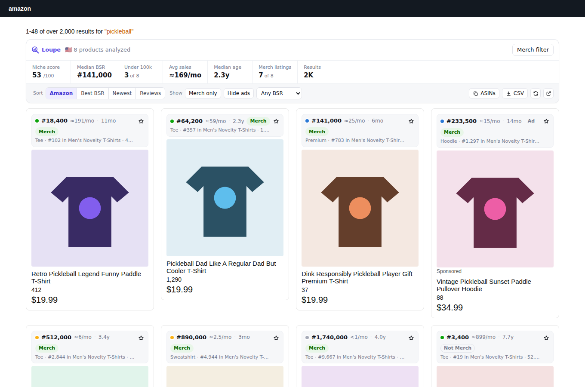
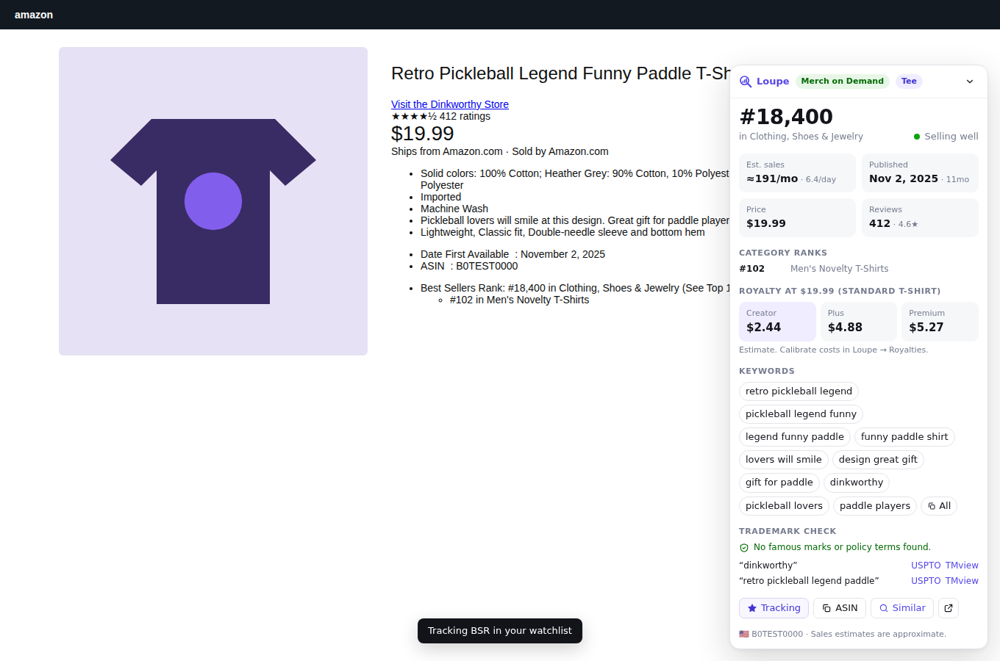
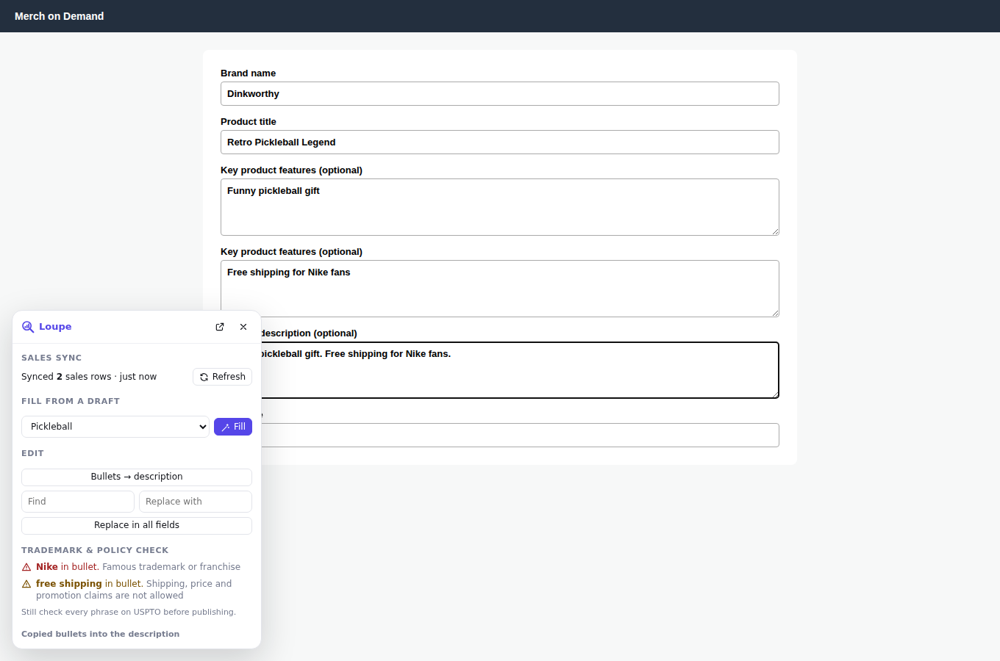
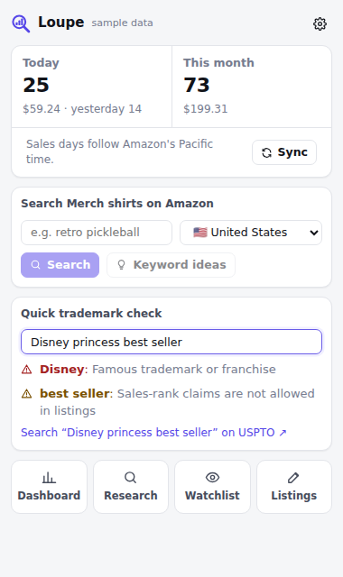
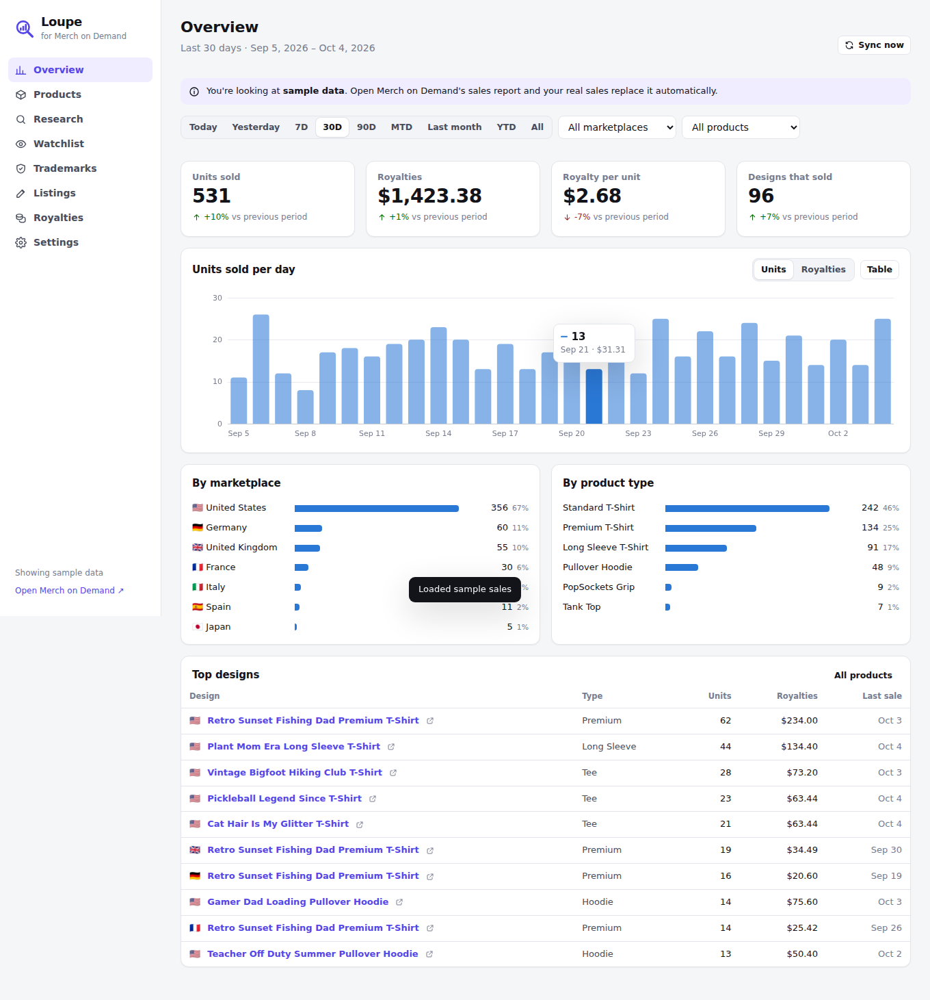

# Loupe for Merch on Demand

A Chrome extension (Manifest V3) for Amazon Merch on Demand sellers. It covers what
**Snap** and **Productor** do (BSR research on Amazon, sales analytics, listing tools,
trademark checks) in one place, and it keeps all your data in your browser.



## What it does

| Area | Features |
| --- | --- |
| **Amazon search** | Toolbar with a **niche score**, median BSR, number of results under 100k BSR, average estimated sales, median age, Merch share and result count. A badge on every result shows its BSR, estimated monthly sales, age, Merch detection, sub-category rank and review count. Sort by best BSR, newest or reviews; filter to Merch only, hide ads, cap the BSR; export CSV; copy ASINs; one-click **Merch filter** that limits the search to Merch shirts. |
| **Amazon product page** | Floating panel: BSR with category ranks, sales estimate, publish date and age, price and reviews, **royalty at this price for all three tiers**, extracted keywords (click to copy), trademark and policy scan with USPTO/TMview links, BSR history, **Track BSR**. |
| **Sales dashboard** | Today, yesterday, 7/30/90 days, month to date, last month, year to date and all time. Units, royalties, royalty per unit and designs sold, each compared with the previous period. Daily, weekly or monthly chart with a table view; breakdowns by marketplace and product type; top designs. Filter by marketplace and product type. Royalties are converted into one currency. |
| **Products** | Every design that has sold, with units, royalties, sales per day, last sale and **days idle**. Designs approaching Merch's no-sale removal window are flagged. Per-design 90-day chart and CSV export. |
| **New-sale alerts** | Desktop notifications for new sales, and today's units on the toolbar icon. Optional live refresh while a Merch tab is open. |
| **Research** | Keyword ideas from Amazon's autocomplete ("seed + a…z", ranked by how often and how high Amazon suggests them), across all seven marketplaces. **Niche analysis**: reads the top Merch results for a keyword and scores demand, competition and freshness from 0 to 100. |
| **Watchlist** | Track any ASIN, yours or a competitor's. Its BSR is re-checked in the background, with a history chart and 7-day change. |
| **Trademarks** | Flags famous brands and franchises, legally protected terms (Olympic, NASA, Red Cross…) and phrases the Merch content policy rejects (shipping, price and review claims, "officially licensed", charity and health claims, URLs). Add your own always-flag and never-flag lists. Every phrase links to USPTO and TMview. |
| **Listings** | Listing studio with Merch's character limits, live trademark check and autosave. **Fill on Merch** puts a draft into the create page in one click. On Merch itself, a dock offers fill-from-draft, **bullets → description**, **find & replace across all fields** and a live trademark check as you type. |
| **Royalties** | Calculator for every product type, marketplace and tier (Creator, Plus, Premium), with price floor, a price ladder and "sales needed for your goal". **Calibrate** against the royalty Merch shows and every estimate for that product becomes exact. |
| **Data** | CSV import (columns matched by name) and export, full JSON backup and restore, sample data for a tour. |

Marketplaces: 🇺🇸 US, 🇬🇧 UK, 🇩🇪 DE, 🇫🇷 FR, 🇮🇹 IT, 🇪🇸 ES, 🇯🇵 JP. Prices, ranks and dates are read in each store's language.

| Product page | Merch create page | Popup |
| --- | --- | --- |
|  |  |  |



## Install

**From a build:** download `loupe-<version>.zip` (the `loupe-extension` artifact on the CI run, or build it yourself), unzip it, then:

1. Open `chrome://extensions` and switch on **Developer mode** (top right).
2. Click **Load unpacked** and choose the unzipped folder.
3. Pin Loupe from the puzzle-piece menu. A welcome page opens.

**From source** (Node 22+):

```bash
cd extension
npm install
npm run build        # outputs dist/; load that folder unpacked
npm run zip          # dist/ packed as loupe-<version>.zip for the Chrome Web Store
```

Works in Chrome 116+ and other Chromium browsers (Edge, Brave, Arc).

## How sales sync works

Merch on Demand has no public API, so Loupe does what you'd do by hand: it reads the
sales report the Merch dashboard loads in your own tab.

- A small script on `merch.amazon.com` observes the JSON the dashboard fetches. It
  doesn't change requests or send anything anywhere.
- Loupe keeps any record that looks like a sale: an ASIN plus units or royalties, with a
  date and marketplace taken from the record, its parent objects, or the request URL.
  This doesn't depend on Merch's exact endpoints or field names, so it survives most redesigns.
- **Refresh** (popup, dock or dashboard) re-loads the reports Loupe has seen, moving their
  date ranges forward to today. **Live refresh** in Settings does this on a timer while a
  Merch tab is open, so new-sale notifications arrive on their own.
- **Settings → Sync diagnostics** lists every endpoint Loupe saw and how many sales rows
  each produced. If sales don't appear, start there.
- **CSV import** is the fallback for anything else.

> I couldn't sign in to a real Merch account while building this, so the capture was
> tested against a stand-in dashboard (`e2e/fixtures.mjs`), not the live one. If your
> report uses field names Loupe doesn't recognise, Sync diagnostics will show 0 rows and
> the key names it saw. Adding them to `KEYS` in `src/shared/sales.ts` is a one-line fix.

## Estimates: read these as ballparks

- **Sales from BSR.** Amazon doesn't publish this. Loupe interpolates between commonly
  observed BSR/sales points for Clothing on amazon.com and scales other marketplaces down by size.
- **Royalties.** Since June 2026 Merch pays three traffic-based tiers. The default model
  reproduces the published $19.99 Standard T-shirt figures ($2.44 / $4.88 / $5.27). Other
  products' production costs are estimates until you calibrate them against Merch's live
  royalty display on the Royalties page.
- **Trademark check.** A fast first pass over well-known marks and policy terms. It is not
  legal advice and not a USPTO search. Use the links to check every phrase.
- **Merch filter.** Merch searches use Amazon's stock Merch bullet text as a hidden
  keyword. The US, UK and DE phrases are well established; if FR, IT, ES or JP searches look
  off, override the URL per marketplace in Settings.

## Privacy and permissions

Everything is stored in `chrome.storage.local` on your machine. There is no account, no
server and no analytics. Saved refresh requests may include headers the Merch page sets,
such as an anti-forgery token; these also stay local.

| Permission | Why |
| --- | --- |
| `amazon.com`, `.co.uk`, `.de`, `.fr`, `.it`, `.es`, `.co.jp` | Search and product page overlays; reading product pages for BSR |
| `merch.amazon.com` | Sales capture and the listing tools dock |
| `completion.amazon.*` | Keyword suggestions |
| `storage`, `unlimitedStorage` | Your sales history, watchlist and drafts |
| `alarms`, `offscreen` | Background BSR refresh for tracked products |
| `notifications` | New-sale alerts |
| `contextMenus` | Right-click on selected text: search Merch, keyword ideas, trademark check |

Product pages are fetched politely: 2 at a time by default, randomly spaced, cached for
12 hours. If Amazon shows a robot check, Loupe pauses and asks you to resume.

## Development

```bash
npm run dev        # rebuild on change; then click reload in chrome://extensions
npm run typecheck
npm test           # 65 unit tests (parsers in all languages, sales normalizer, royalty model…)
npm run e2e        # builds, loads the extension in Chromium, drives every surface, saves screenshots
```

The e2e run uses `/opt/pw-browsers/chromium` if present, else `CHROMIUM_PATH`, else
Playwright's Chromium (`npx playwright-core install chromium`).

```
src/
  shared/      Pure logic: parsers, BSR and royalty models, sales normalizer, analytics, storage
  content/
    amazon/    Search overlay and product panel (Preact in shadow DOM)
    merch/     main-world.ts (capture) and index.tsx (dock, listing tools)
  background/  Service worker: sales merging, notifications, badge, alarms, context menus
  offscreen/   DOMParser for background BSR refreshes
  dashboard/   Full-page app: overview, products, research, watchlist, trademarks, listings, royalties, settings
  popup/       Toolbar popup
  ui/          Shared components, charts, icons, stylesheet (light and dark)
```

Not affiliated with or endorsed by Amazon. "Merch on Demand" is used only to describe compatibility.
